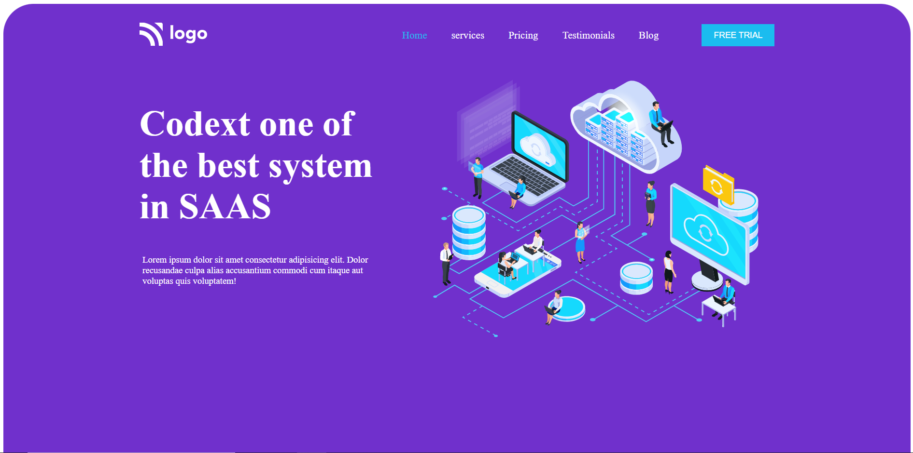

# Project 13 - HTML and CSS

By Piyush Bhatt

Deployed link of website &nbsp; 

 

# [Link to Project 13](https://saas-landingpage.vercel.app/)

 

# Preview of the Project.

 

## What I learnt in this Project?

- I learned about how to make website **layout** through **flexbox.**
- I also learnt about how to make **cards** and adjust using flex properties.
- I also learn how to **insert small png** icon like share,forward etc.
- I also learn how **change color** of png icon using **filter property.**

  

# Time Taken to complete  this project is 3 hour.